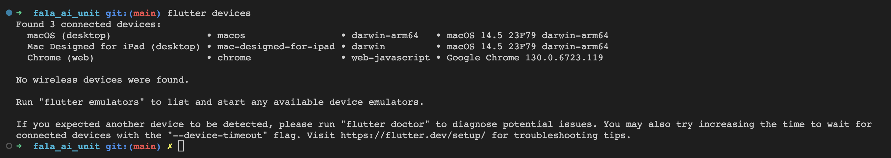
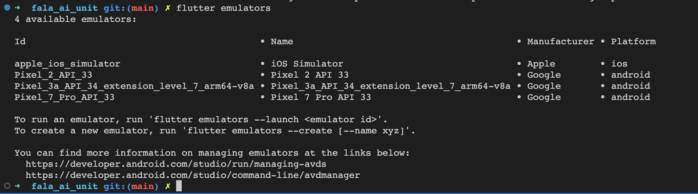

# fala_ai_unit

Aplicação flutter Fala Ai Unit

## Dependências

- flutter (https://docs.flutter.dev/get-started/install)
- git (https://git-scm.com/downloads)
- backend fala_ai_unit (https://github.com/BrunoHolanda23/FalaAiUnitBackend)
- emulador android ou ios (caso queira executar como app mobile)

## Como rodar o projeto

1.  Com todas as dependências instaladas no seu computador, clone o repositório deste projeto:

```shell
git clone git@github.com:BrunoHolanda23/FalaAiUnitFlutter.git
```

2.  Execute o projeto FalaAiUnitBackend seguindo os passos de execução do [projeto](https://github.com/BrunoHolanda23/FalaAiUnitBackend/blob/main/README.md)

3.  No diretório do projeto flutter, pelo terminal, instale as dependencias do projeto flutter:

```shell
flutter pub get
```

4. Verifique os devices disponíveis para executar a aplicação:

```shell
flutter devices
```

- deve aparecer algo assim:
  

5. Execute o app no chrome:

```shell
flutter run -d chrome
```

- obs: o `chrome` no comando acima é referente ao device_id do navegador Chrome (representado na 2° coluna do 3° item listados ao executar o comando `flutter devices`)

6. O device deve ser executado acessando a aplicação diretamente. Agora é só usar o app.

### Caso queira executar num emulador mobile, siga os seguintes passos a partir da instalação das dependências do projeto flutter:

- Verifique os emuladores disponíveis:

```shell
flutter emulators
```

- deve aparecer algo assim:
  

- Defina qual emulador você quer usar, e inicialize-o para adicioná-lo aos devices:

```shell
flutter emulators --launch Pixel_7_Pro_API_33
```

- OBS: o `Pixel_7_Pro_API_33` é um exemplo. substitua-o por um emulador válido no seu caso.

- Verifique os devices disponíveis para executar a aplicação:

```shell
flutter devices
```

- O device do emulador deverá aparecer na lista. Com isso, execute o comando para rodar o app:

```shell
flutter run -d ${DEVICE_ID}
```

- substitua `${DEVICE_ID}` pelo id do device do emulador.

- Pronto, o app será inicializado no emulador mobile.
